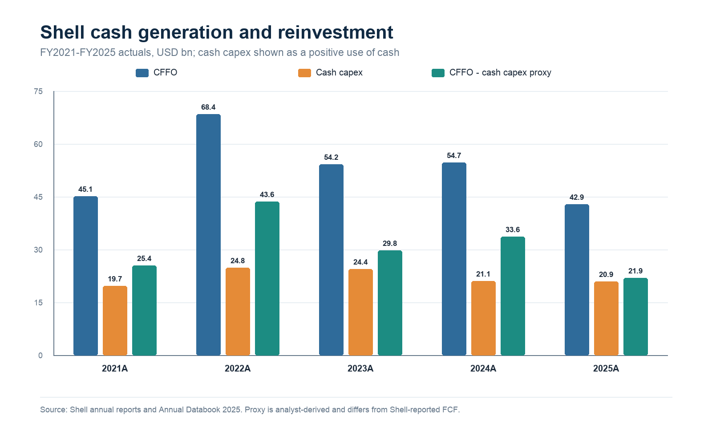
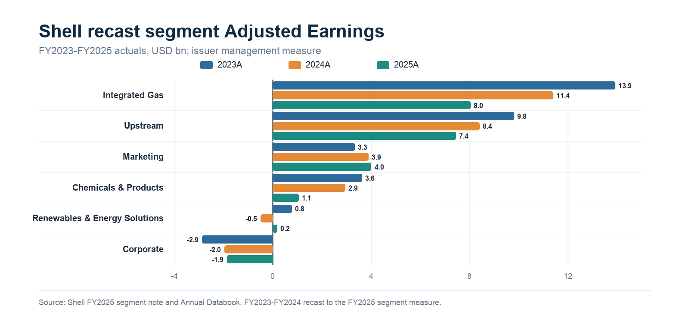

# Shell plc - Compact Institutional Equity Research Sample

**Research date and cutoff:** July 15, 2026  
**Issuer / securities:** Shell plc; LSE: SHEL ordinary shares; NYSE: SHEL ADSs (two ordinary shares per ADS)  
**Reporting basis:** IFRS; fiscal year ends December 31; USD reporting currency  
**Latest reported period:** Q1 2026, unaudited IAS 34 interim results published May 7, 2026  
**Valuation reference:** LSE close on July 14, 2026; Q1 2026 net debt  
**Scope:** Compact research sample; no rating, recommendation, or target price

> This sample is general research information, not personalized investment advice. Figures are rounded, and totals may not sum. The report uses public or permitted data available by the cutoff.

## Evidence labels and central question

| Label | Meaning |
|---|---|
| **[R] Reported fact** | Filing, issuer release, exchange, regulator, or official-industry datum |
| **[M] Management statement** | Guidance, target, outlook, or transaction expectation |
| **[C] Derived calculation** | Deterministic formula using cited inputs |
| **[A] Analyst assumption** | Visible scenario or valuation input, not a company forecast |
| **[I] Interpretation** | Analytical judgment, with counterevidence where material |

**[I] Central question:** Can Shell convert its diversified earnings base into durable cash after the Q1 working-capital draw, while funding a larger 2026 capital program and the proposed ARC Resources acquisition without weakening balance-sheet flexibility or shareholder returns?

## 1. Research dashboard

| Investor question | Latest evidence | Why it matters |
|---|---|---|
| Is the cash engine strengthening? | **[R]** FY2025 CFFO was $42.9bn and cash capex was $20.9bn. **[C]** The resulting analyst proxy was $21.9bn, down 34.7% from FY2024. | Lower cash generation reduces the cushion for capex, distributions, and acquisition funding. |
| Was Q1 earnings strength cash-backed? | **[R]** Q1 2026 Adjusted Earnings were $6.9bn, but CFFO was $6.1bn after an $11.2bn working-capital outflow. Shell reported $17.2bn of CFFO excluding working capital. | Q2 cash conversion, not Q1 adjusted profit alone, is the near-term confirmation point. |
| Where are earnings concentrated? | **[C]** Integrated Gas and Upstream produced $15.5bn, or 82.2%, of FY2025 segment Adjusted Earnings before the NCI bridge. | LNG, upstream volumes, and commodity prices dominate group earnings sensitivity. |
| Is capital allocation self-funded? | **[C]** FY2025 dividends plus buybacks were 52.1% of CFFO, versus Shell's **[M]** 40%-50% through-cycle framework; Q1 net debt rose $6.9bn. | Returns above the framework can be temporary, but persistent overspend would pressure leverage. |
| What does the market imply? | **[C]** At the dated market inputs below, enterprise value was about $284.2bn. The FY2025 and three-year-average cash-flow-proxy yields were 7.7% and 10.0%. | The valuation depends more on mid-cycle cash normalization than on near-term accounting earnings. |

Sources: FY2025 and Q1 results, capital-allocation framework, and dated market inputs.[S1](https://www.sec.gov/Archives/edgar/data/1306965/000162828026017024/shel-20251231.htm) [S3](https://www.shell.com/investors/results-and-reporting/annual-report/_jcr_content/root/main/section_2113846431/text/links/item0.stream/1775009511288/4a4691b2760caa375e559d3a778a57eea2014695/shell-annual-databook-25.xlsx) [S7](https://www.shell.com/investors/results-and-reporting/quarterly-results/_jcr_content/root/main/section/simple_copy/promo_1962010312_cop/links/item1.stream/1778115266512/cad4d5b6af7a44f1bb371e2ea4c468ad5125af11/q1-2026-qra-document.pdf) [S10](https://www.shell.com/investors/results-and-reporting/progress-on-cmd25.html) [S13](https://www.londonstockexchange.com/stock/SHEL/shell-plc) [S14](https://www.ofx.com/en-gb/forex-news/historical-exchange-rates/usd/)

## 2. Company and business-model overview

**[R]** Shell is incorporated in England and Wales and is a foreign private issuer. It files annual reports on Form 20-F and furnishes interim/current information on Form 6-K; it is not a US domestic Form 10-K/10-Q filer. FY2025 statements were prepared under UK-adopted international accounting standards and IFRS as issued by the IASB; Q1 2026 condensed statements were prepared under IAS 34.[S1](https://www.sec.gov/Archives/edgar/data/1306965/000162828026017024/shel-20251231.htm) [S7](https://www.shell.com/investors/results-and-reporting/quarterly-results/_jcr_content/root/main/section/simple_copy/promo_1962010312_cop/links/item1.stream/1778115266512/cad4d5b6af7a44f1bb371e2ea4c468ad5125af11/q1-2026-qra-document.pdf)

**[R]** The reporting structure has six segments: Integrated Gas; Upstream; Marketing; Chemicals & Products; Renewables & Energy Solutions; and Corporate. Integrated Gas combines gas production, LNG and gas-to-liquids processing, infrastructure, marketing, trading, and optimization. Upstream produces oil, gas, and natural-gas liquids. Marketing includes mobility, lubricants, and customer decarbonization products. Chemicals & Products combines refining, chemicals, pipelines, and trading. Renewables & Energy Solutions includes power, pipeline gas, hydrogen, carbon capture, and related marketing and optimization.[S7](https://www.shell.com/investors/results-and-reporting/quarterly-results/_jcr_content/root/main/section/simple_copy/promo_1962010312_cop/links/item1.stream/1778115266512/cad4d5b6af7a44f1bb371e2ea4c468ad5125af11/q1-2026-qra-document.pdf)

**[I] Why it matters:** Integration can shift margin among production, LNG, refining, marketing, and trading, reducing reliance on one line item. It does not remove commodity, geopolitical, or capital-intensity risk; it makes consolidated cash-flow analysis and segment-level causal drivers more important than revenue alone.

## 3. Five-year financial performance

### Normalized annual record

| USD bn, except shares | FY2021A | FY2022A | FY2023A | FY2024A | FY2025A |
|---|---:|---:|---:|---:|---:|
| Revenue **[R]** | 261.5 | 381.3 | 316.6 | 284.3 | 266.9 |
| Income attributable to Shell shareholders **[R]** | 20.1 | 42.3 | 19.4 | 16.1 | 17.8 |
| Adjusted Earnings **[R]** | 19.3 | 39.9 | 28.3 | 23.7 | 18.5 |
| CFFO **[R]** | 45.1 | 68.4 | 54.2 | 54.7 | 42.9 |
| Cash capital expenditure **[R]** | 19.7 | 24.8 | 24.4 | 21.1 | 20.9 |
| CFFO less cash capex proxy **[C]** | 25.4 | 43.6 | 29.8 | 33.6 | 21.9 |
| Net debt at year-end **[R]** | 52.6 | 44.8 | 43.5 | 38.8 | 45.7 |
| Diluted weighted-average ordinary shares, bn **[R]** | 7.807 | 7.411 | 6.800 | 6.364 | 5.949 |

Formula: `CFFO less cash capex proxy = cash flow from operating activities - cash capital expenditure`. Cash capex is shown as a positive use of cash. This analyst proxy is not Shell's reported Free Cash Flow, which Shell defines as CFFO plus cash flow from investing activities. Sources: Shell annual reports and Annual Databook; FY2024 cash capex uses the audited $21.085bn reconciliation rather than the databook's $21.084bn display.[S2](https://www.shell.com/investors/results-and-reporting/annual-report/_jcr_content/root/main/section_2113846431/link_list/links/item3.stream/1773292255440/bc68032ad3986f04e8401c7f1d4d20885e16c950/consolidated-financial-statements-ar25.pdf) [S3](https://www.shell.com/investors/results-and-reporting/annual-report/_jcr_content/root/main/section_2113846431/text/links/item0.stream/1775009511288/4a4691b2760caa375e559d3a778a57eea2014695/shell-annual-databook-25.xlsx) [S4](https://www.shell.com/investors/results-and-reporting/annual-report-archive/_jcr_content/root/main/section_812377294/tabs/tab/text.multi.stream/1742905301176/ce28b952e201476287788cfcf35406e464f9785c/shell-annual-report-2023.pdf) [S5](https://www.shell.com/investors/results-and-reporting/annual-report-archive/_jcr_content/root/main/section_812377294/tabs/tab_338953895/text.multi.stream/1742905417223/ddb70e54fdb262fa1e81db12f2d92233672f779d/shell-annual-report-2021.pdf)

**[C] Trend read-through:** FY2025 revenue fell 6.1%, Adjusted Earnings fell 21.9%, and the cash-flow proxy fell 34.7% year over year. Reported shareholder income rose 10.8%, showing that reported and adjusted earnings moved in opposite directions. From FY2023 to FY2025, the diluted weighted-average share count declined 12.5%.[S2](https://www.shell.com/investors/results-and-reporting/annual-report/_jcr_content/root/main/section_2113846431/link_list/links/item3.stream/1773292255440/bc68032ad3986f04e8401c7f1d4d20885e16c950/consolidated-financial-statements-ar25.pdf)

**[I] Why it matters:** Buybacks increased each remaining share's claim on the business, but the 2025 cash decline shows that per-share support cannot substitute indefinitely for operating cash generation. The investment case needs a mid-cycle cash view, not extrapolation from either the 2022 peak or Q1 2026 adjusted earnings.

**Amendment and recast discipline:** Shell updated its 2023 and 2024 Forms 20-F in July 2025 because of an auditor-independence matter. The financial statements were unchanged and unqualified opinions were reissued. Separately, 2025 segment reporting changed to Adjusted Earnings and prior segment comparatives were recast; the segment analysis below uses the recast series rather than mixing definitions.[S6](https://www.shell.com/news-and-insights/newsroom/news-and-media-releases/2025/shell-to-update-2023-and-2024-form20-fs.html) [S2](https://www.shell.com/investors/results-and-reporting/annual-report/_jcr_content/root/main/section_2113846431/link_list/links/item3.stream/1773292255440/bc68032ad3986f04e8401c7f1d4d20885e16c950/consolidated-financial-statements-ar25.pdf)

## 4. Segment analysis

| Adjusted Earnings, USD bn | FY2023A recast | FY2024A recast | FY2025A |
|---|---:|---:|---:|
| Integrated Gas | 13.919 | 11.390 | 8.024 |
| Upstream | 9.806 | 8.395 | 7.442 |
| Marketing | 3.312 | 3.885 | 3.994 |
| Chemicals & Products | 3.616 | 2.934 | 1.051 |
| Renewables & Energy Solutions | 0.756 | (0.497) | 0.172 |
| Corporate | (2.875) | (1.968) | (1.870) |
| Total including NCI | 28.534 | 24.139 | 18.813 |
| Attributable to Shell shareholders | 28.250 | 23.716 | 18.528 |

Shell's segment Adjusted Earnings is the chief-operating-decision-maker measure and is not IFRS segment net income. The NCI bridge was $0.285bn in FY2025. Sources: recast segment note and Annual Databook.[S2](https://www.shell.com/investors/results-and-reporting/annual-report/_jcr_content/root/main/section_2113846431/link_list/links/item3.stream/1773292255440/bc68032ad3986f04e8401c7f1d4d20885e16c950/consolidated-financial-statements-ar25.pdf) [S3](https://www.shell.com/investors/results-and-reporting/annual-report/_jcr_content/root/main/section_2113846431/text/links/item0.stream/1775009511288/4a4691b2760caa375e559d3a778a57eea2014695/shell-annual-databook-25.xlsx)

**[C]** Integrated Gas plus Upstream supplied $15.466bn, or 82.2%, of FY2025 total segment Adjusted Earnings including NCI. **[I]** This concentration makes LNG availability, upstream production, realized prices, and trading/optimization the principal group earnings drivers. Marketing was comparatively stable, while Chemicals & Products declined to $1.1bn and Renewables & Energy Solutions was near break-even on the segment measure.

**[R] Latest-quarter cross-check:** Q1 2026 segment Adjusted Earnings were $1.819bn Integrated Gas, $2.377bn Upstream, $1.334bn Marketing, $1.925bn Chemicals & Products, $0.348bn Renewables & Energy Solutions, and negative $0.908bn Corporate. Within Chemicals & Products, Chemicals lost about $0.1bn while Products earned about $2.0bn. Shell said most underlying Renewables & Energy Solutions activities were loss-making, offset by trading, optimization, and energy marketing.[S7](https://www.shell.com/investors/results-and-reporting/quarterly-results/_jcr_content/root/main/section/simple_copy/promo_1962010312_cop/links/item1.stream/1778115266512/cad4d5b6af7a44f1bb371e2ea4c468ad5125af11/q1-2026-qra-document.pdf)

**[I] Why it matters:** The Q1 mix demonstrates the benefit and opacity of integration: downstream/trading strength can offset production pressure, but one quarter's optimization result should not be treated as a stable annuity. Investors should monitor physical volumes, margins, and cash by segment alongside adjusted earnings.

## 5. Cash flow, capex, balance sheet, liquidity, and shareholder returns

| USD bn, except gearing | FY2023A | FY2024A | FY2025A | Q1 2026A |
|---|---:|---:|---:|---:|
| CFFO **[R]** | 54.191 | 54.687 | 42.863 | 6.062 |
| Cash capex **[R]** | 24.392 | 21.085 | 20.915 | 4.202 |
| CFFO less cash capex proxy **[C]** | 29.799 | 33.602 | 21.948 | 1.860 |
| Net debt, period-end **[R]** | 43.542 | 38.809 | 45.687 | 52.606 |
| Gearing, period-end **[R]** | 18.8% | 17.7% | 20.7% | 23.2% |
| Cash dividends paid **[R]** | 8.393 | 8.668 | 8.472 | 2.1 |
| Share repurchases, cash **[R]** | 14.617 | 13.898 | 13.879 | 3.2 |

Q1 is a discrete quarter and is not annualized. FY figures use cash-flow-statement cash uses; Q1 distribution values are rounded issuer disclosures. Sources: annual statements and Q1 results.[S2](https://www.shell.com/investors/results-and-reporting/annual-report/_jcr_content/root/main/section_2113846431/link_list/links/item3.stream/1773292255440/bc68032ad3986f04e8401c7f1d4d20885e16c950/consolidated-financial-statements-ar25.pdf) [S7](https://www.shell.com/investors/results-and-reporting/quarterly-results/_jcr_content/root/main/section/simple_copy/promo_1962010312_cop/links/item1.stream/1778115266512/cad4d5b6af7a44f1bb371e2ea4c468ad5125af11/q1-2026-qra-document.pdf)

**[R] Liquidity:** At March 31, 2026, Shell had $23.1bn of cash and cash equivalents, $75.6bn of total debt, and $52.6bn of net debt. At year-end 2025, $0.586bn of $30.2bn cash was subject to currency-control or legal restrictions. Shell also reported $8bn of undrawn committed revolving facilities.[S1](https://www.sec.gov/Archives/edgar/data/1306965/000162828026017024/shel-20251231.htm) [S15](https://www.shell.com/investors/debt-information.html)

**[C] Capital allocation:** FY2025 cash dividends plus repurchases were $22.351bn, equal to 52.1% of CFFO: `($8.472bn + $13.879bn) / $42.863bn`. That exceeded the top of Shell's **[M]** 40%-50% through-cycle distribution framework for the year. Q1 net debt increased $6.919bn from year-end. Shell attributed the movement to distributions, interest, and a $3.9bn increase in lease liabilities, including a $3.2bn non-cash variable-shipping-lease component, partly offset by free cash flow.[S7](https://www.shell.com/investors/results-and-reporting/quarterly-results/_jcr_content/root/main/section/simple_copy/promo_1962010312_cop/links/item1.stream/1778115266512/cad4d5b6af7a44f1bb371e2ea4c468ad5125af11/q1-2026-qra-document.pdf) [S10](https://www.shell.com/investors/results-and-reporting/progress-on-cmd25.html)

**[M] Forward capital needs:** After announcing the proposed ARC Resources acquisition, Shell raised 2026 cash-capex guidance to $24bn-$26bn, including about $4bn for ARC, while retaining $20bn-$22bn for 2027-2028. The transaction consideration includes about $3.4bn cash and about $10.2bn of Shell shares, plus assumption of ARC net debt and leases.[S8](https://www.shell.com/investors/results-and-reporting/quarterly-results/_jcr_content/root/main/section/simple_copy/promo_1962010312_cop/links/item0.stream/1778115268202/e177be427a9e32c1ade2cd6530cf0fdffce50c4f/q1-2026-quarterly-press-release.pdf) [S11](https://www.shell.com/news-and-insights/newsroom/news-and-media-releases/2026/shell-announces-agreement-to-acquire-canadian-energy-company-arc-resources.html)

**[I] Why it matters:** Liquidity is substantial, but the margin of safety is narrower than the cash balance suggests because distributions, lease movements, higher capex, and acquisition funding compete for the same cash. A working-capital reversal and post-transaction net-debt path are the next balance-sheet tests.

## 6. Earnings-quality observations

1. **Adjusted-versus-reported convergence improved in FY2025.** **[C]** Adjusted Earnings exceeded reported shareholder income by $8.891bn in FY2023, $7.622bn in FY2024, and only $0.691bn in FY2025. **[I]** The smaller 2025 bridge improves comparability for that year, but the large prior gaps show why a multi-year adjusted series needs its reconciliation.[S2](https://www.shell.com/investors/results-and-reporting/annual-report/_jcr_content/root/main/section_2113846431/link_list/links/item3.stream/1773292255440/bc68032ad3986f04e8401c7f1d4d20885e16c950/consolidated-financial-statements-ar25.pdf)
2. **Cash conversion was strong annually but weak in Q1.** **[C]** FY2025 CFFO was 2.40 times reported shareholder income. **[R]** Q1 CFFO of $6.1bn was reduced by an $11.2bn working-capital outflow; CFFO excluding working capital was $17.2bn. **[I]** The quarter is a timing signal, not proof of structural deterioration, but it should not be annualized.[S7](https://www.shell.com/investors/results-and-reporting/quarterly-results/_jcr_content/root/main/section/simple_copy/promo_1962010312_cop/links/item1.stream/1778115266512/cad4d5b6af7a44f1bb371e2ea4c468ad5125af11/q1-2026-qra-document.pdf)
3. **Derivative and adjustment volatility remains material.** **[R]** Q1 reported income attributable to shareholders was $5.694bn versus Adjusted Earnings of $6.915bn; identified items included adverse commodity-derivative fair-value effects. **[I]** Trading and hedging economics should be assessed across realized cash, inventory, and derivatives, not from one accounting line.[S7](https://www.shell.com/investors/results-and-reporting/quarterly-results/_jcr_content/root/main/section/simple_copy/promo_1962010312_cop/links/item1.stream/1778115266512/cad4d5b6af7a44f1bb371e2ea4c468ad5125af11/q1-2026-qra-document.pdf)
4. **The expected cash reversal is not yet an actual.** **[M]** Shell's July 7 update indicated a Q2 working-capital inflow of $1bn-$6bn. Final Q2 results were scheduled for July 30, after this report's cutoff. **[I]** The size and quality of the reversal, together with net debt, are the most important near-term earnings-quality checks.[S9](https://www.shell.com/news-and-insights/newsroom/news-and-media-releases/2026/shell-second-quarter-2026-update-note/_jcr_content/root/main/section/simple_copy/call_to_action/links/item0.stream/1783398975117/5124ffff4831d6554ee06a5cbd6dcc52eb24b838/q2-2026-quarterly-update-note.pdf) [S17](https://www.shell.com/news-and-insights/newsroom/news-and-media-releases/2026/advance-notice-of-second-quarter-2026-results-and-second-quarter-2026-interim-dividend-announcement.html)

## 7. Industry and competitive context

**[R] Near-term gas market:** The IEA's Q3 2026 Gas Market Report expected global gas demand to contract about 0.5% in 2026. It described disrupted Gulf LNG supply, elevated prices, and uncertainty around Strait of Hormuz normalization. **[I]** For Shell, this is two-sided: constrained supply can support prices and optimization margins, while asset disruption and demand destruction can reduce physical volumes.[S16](https://www.iea.org/reports/gas-market-report-q3-2026/executive-summary)

**[M] Long-term issuer view:** Shell's LNG Outlook estimated global LNG demand could reach about 700 million tonnes by 2050, around 65% above 2025. **[I]** That supports the strategic logic of an integrated LNG position, but it is a management outlook over a long horizon and does not override the IEA's weaker near-term demand view.[S18](https://www.shell.com/news-and-insights/newsroom/news-and-media-releases/2026/lng-outlook-2026.html)

**[I] Competitive position:** Shell's disclosed advantage is breadth across LNG, upstream, refining, marketing, and trading rather than a single-product cost claim. That breadth can monetize volatility across the chain, but it also adds operational complexity and makes external comparison sensitive to different segment definitions. A dated, consistently defined peer-multiple set was **Insufficient public data** within this compact sample; no peer ranking or relative-multiple claim is made.

## 8. Investment thesis

| Thesis point | Evidence and causal path | Counterevidence / monitor |
|---|---|---|
| **1. Cash normalization is the key rerating variable.** | **[I]** Partial Q1 working-capital reversal -> higher CFFO -> lower net debt or more self-funded distributions -> stronger enterprise cash-flow yield. | **[M]** Q2 inflow guidance is $1bn-$6bn, well below the Q1 outflow. Monitor reported Q2 CFFO, working capital, and net debt. |
| **2. Core profit pools are concentrated but economically advantaged by integration.** | **[C]** Integrated Gas plus Upstream were 82.2% of FY2025 segment Adjusted Earnings -> LNG/upstream recovery has high group earnings impact -> valuation remains commodity-sensitive. | Q2 Integrated Gas production guidance fell to 610-650 kboe/d from 909 in Q1. Monitor volume recovery, realized prices, and trading contribution. |
| **3. Buybacks have improved per-share exposure, but balance-sheet discipline now matters more.** | **[C]** Diluted shares fell 12.5% from FY2023 to FY2025 -> remaining-share participation rose. **[I]** If distributions remain within sustainable CFFO, per-share value can compound. | FY2025 distributions were 52.1% of CFFO, above the framework's annual top end, and Q1 gearing rose. Monitor distribution/CFFO and gearing after ARC. |
| **4. Portfolio high-grading can sharpen returns, but ARC changes execution risk.** | **[R]** Shell agreed to sell Sprng Energy for $1.8bn and proposed acquiring ARC for about $16.4bn enterprise value. **[M]** Management expects ARC to be accretive from 2027. | Accretion, synergies, closing, integration, cash funding, and about 228m new ordinary shares remain forward-looking. Monitor closing terms and first full-year cash contribution. |

Sources for the factual premises and guidance: Q1/Q2 materials, capital framework, ARC announcement, and Sprng sale.[S7](https://www.shell.com/investors/results-and-reporting/quarterly-results/_jcr_content/root/main/section/simple_copy/promo_1962010312_cop/links/item1.stream/1778115266512/cad4d5b6af7a44f1bb371e2ea4c468ad5125af11/q1-2026-qra-document.pdf) [S9](https://www.shell.com/news-and-insights/newsroom/news-and-media-releases/2026/shell-second-quarter-2026-update-note/_jcr_content/root/main/section/simple_copy/call_to_action/links/item0.stream/1783398975117/5124ffff4831d6554ee06a5cbd6dcc52eb24b838/q2-2026-quarterly-update-note.pdf) [S10](https://www.shell.com/investors/results-and-reporting/progress-on-cmd25.html) [S11](https://www.shell.com/news-and-insights/newsroom/news-and-media-releases/2026/shell-announces-agreement-to-acquire-canadian-energy-company-arc-resources.html) [S12](https://www.shell.com/news-and-insights/newsroom/news-and-media-releases/2026/shell-to-sell-sprng-energy-group.html)

## 9. Key catalysts

| Timing known at cutoff | Catalyst | Investor transmission path |
|---|---|---|
| July 30, 2026 | Q2 results and interim dividend | Reported working-capital reversal, Integrated Gas volumes, refining/trading contribution, capex, and net debt can confirm or weaken thesis points 1-3.[S17](https://www.shell.com/news-and-insights/newsroom/news-and-media-releases/2026/advance-notice-of-second-quarter-2026-results-and-second-quarter-2026-interim-dividend-announcement.html) |
| H2 2026, subject to conditions | Proposed ARC closing | Changes production, capex, cash use, debt/lease exposure, and share count; transaction economics begin to replace announcement assumptions.[S11](https://www.shell.com/news-and-insights/newsroom/news-and-media-releases/2026/shell-announces-agreement-to-acquire-canadian-energy-company-arc-resources.html) |
| By end-2026, subject to approvals | Sprng Energy sale | A $1.8bn expected cash consideration would support portfolio high-grading and liquidity, subject to adjustments and closing.[S12](https://www.shell.com/news-and-insights/newsroom/news-and-media-releases/2026/shell-to-sell-sprng-energy-group.html) |
| Medium term | LNG Canada ramp and restoration of affected Integrated Gas production | Higher physical availability could improve cash conversion, while delay would prolong reliance on trading and price effects. |

## 10. Key risks and thesis-breaking conditions

| Risk | Leading indicator | Thesis-breaking condition |
|---|---|---|
| Prolonged Middle East or LNG disruption | Integrated Gas production, LNG liquefaction, force-majeure disclosures | Physical availability remains materially impaired beyond management's repair/normalization timetable and cash contribution does not recover. |
| ARC funding, dilution, and integration | Final consideration, new shares, 2026 capex, net debt, realized synergies | The transaction closes on materially worse economics or fails to produce credible per-share cash accretion after its first full operating year. |
| Weak cash conversion | Working capital, CFFO, proxy cash flow, net debt | The working-capital outflow does not materially reverse and `CFFO - cash capex` remains below $20bn for two annual periods. The $20bn level is an **[A]** monitoring threshold, not company guidance. |
| Distribution policy stresses leverage | Dividends plus buybacks/CFFO, gearing, credit access | Cash distributions and capex repeatedly exceed CFFO while net debt and gearing continue to rise after transaction effects normalize. |
| Commodity, refining, chemical, and trading volatility | Realized prices, refining/chemical margins, identified items | Sustained price or margin weakness removes the cash normalization assumed in the base case. |
| Transition, regulatory, litigation, and impairment risk | Carbon policy, project sanctions, provisions, impairments | Required capital or asset write-downs structurally reduce normalized cash below the valuation range. |

**[I] Why it matters:** These conditions make the thesis falsifiable. They focus on cash, leverage, and per-share economics rather than using share-price weakness alone as evidence that the operating thesis failed.

## 11. Bull, base, and bear scenarios

These are valuation sensitivities, not forecasts or probabilities. The user's request for scenarios and valuation is treated as authorization to use the visible **[A]** assumptions below; no target price is produced.

| Case | Normalized annual `CFFO - cash capex` **[A]** | Operating path **[A]/[I]** | Model-implied EV at 8.0% yield **[C]** | Equity value less $52.606bn net debt **[C]** | Difference from dated market cap **[C]** |
|---|---:|---|---:|---:|---:|
| Bear | $20bn | Weak commodity/refining conditions; limited working-capital recovery; disruption and integration costs | $250.0bn | $197.4bn | (14.8%) |
| Base | $27bn | Partial working-capital recovery; capex discipline; operations normalize below the FY2023-FY2025 average | $337.5bn | $284.9bn | +23.0% |
| Bull | $32bn | Stronger physical volumes, trading/refining contribution, and portfolio execution; still below FY2024 proxy | $400.0bn | $347.4bn | +50.0% |

Formulas: `Model-implied EV = normalized annual cash-flow proxy / 8.0%`; `Model-implied equity value = EV - Q1 2026 net debt`; `Difference from market cap = model-implied equity value / dated USD market cap - 1`. The same formulas and yield are used in every case. Input anchors: FY2025 proxy $21.948bn; FY2023-FY2025 average $28.450bn; FY2024 proxy $33.602bn.[S2](https://www.shell.com/investors/results-and-reporting/annual-report/_jcr_content/root/main/section_2113846431/link_list/links/item3.stream/1773292255440/bc68032ad3986f04e8401c7f1d4d20885e16c950/consolidated-financial-statements-ar25.pdf) [S7](https://www.shell.com/investors/results-and-reporting/quarterly-results/_jcr_content/root/main/section/simple_copy/promo_1962010312_cop/links/item1.stream/1778115266512/cad4d5b6af7a44f1bb371e2ea4c468ad5125af11/q1-2026-qra-document.pdf)

## 12. Transparent valuation assessment

**Dated market bridge:** **[R]** The LSE page showed a July 14, 2026 close of 3,147 pence and an ordinary-share market capitalization of GBP173.200bn. **[R]** The July 14 GBP/USD reference used here is 1.337372. **[C]** `USD market cap = GBP173.200bn x 1.337372 = $231.633bn`; `enterprise value = $231.633bn + $52.606bn Q1 net debt = $284.239bn`.[S13](https://www.londonstockexchange.com/stock/SHEL/shell-plc) [S14](https://www.ofx.com/en-gb/forex-news/historical-exchange-rates/usd/) [S7](https://www.shell.com/investors/results-and-reporting/quarterly-results/_jcr_content/root/main/section/simple_copy/promo_1962010312_cop/links/item1.stream/1778115266512/cad4d5b6af7a44f1bb371e2ea4c468ad5125af11/q1-2026-qra-document.pdf)

**Observed enterprise cash-flow yields:** **[C]** `FY2025 proxy yield = $21.948bn / $284.239bn = 7.7%`; `FY2023-FY2025 average proxy yield = $28.450bn / $284.239bn = 10.0%`.

| Base proxy yield assumption **[A]** | Model-implied EV **[C]** | Model-implied equity value **[C]** | Difference from dated market cap **[C]** |
|---:|---:|---:|---:|
| 7.0% | $385.7bn | $333.1bn | +43.8% |
| 8.0% | $337.5bn | $284.9bn | +23.0% |
| 9.0% | $300.0bn | $247.4bn | +6.8% |

Sensitivity formula: `Equity value = $27bn normalized proxy / required enterprise proxy yield - $52.606bn net debt`.

**[I] Assessment:** The dated market value appears consistent with a cautious view of cash normalization: it capitalizes FY2025's depressed proxy at a 7.7% enterprise yield, while the three-year average implies 10.0%. The sensitivity shows upside only if Shell can sustain cash generation above FY2025 without a commensurate increase in net debt. The bear case shows that an 8% yield does not protect value if normalized cash falls to $20bn.

**Limit of the method:** This is an enterprise cash-flow-yield sensitivity, not a DCF, sum-of-the-parts appraisal, reserve valuation, target price, or recommendation. It does not separately model commodity prices, reserves, decommissioning, taxes, ARC incremental cash flows, or the approximately 228m shares expected in the ARC consideration. It combines a July 14 market capitalization with March 31 net debt because no later reported balance sheet existed at the cutoff. It must be re-based after Q2 results and any transaction closing.

## 13. Sources and limitations

### Primary and official sources

1. [S1 - Shell FY2025 Form 20-F, filed March 12, 2026](https://www.sec.gov/Archives/edgar/data/1306965/000162828026017024/shel-20251231.htm)
2. [S2 - Shell FY2025 consolidated financial statements](https://www.shell.com/investors/results-and-reporting/annual-report/_jcr_content/root/main/section_2113846431/link_list/links/item3.stream/1773292255440/bc68032ad3986f04e8401c7f1d4d20885e16c950/consolidated-financial-statements-ar25.pdf)
3. [S3 - Shell Annual Databook 2025](https://www.shell.com/investors/results-and-reporting/annual-report/_jcr_content/root/main/section_2113846431/text/links/item0.stream/1775009511288/4a4691b2760caa375e559d3a778a57eea2014695/shell-annual-databook-25.xlsx)
4. [S4 - Shell Annual Report 2023](https://www.shell.com/investors/results-and-reporting/annual-report-archive/_jcr_content/root/main/section_812377294/tabs/tab/text.multi.stream/1742905301176/ce28b952e201476287788cfcf35406e464f9785c/shell-annual-report-2023.pdf)
5. [S5 - Shell Annual Report 2021](https://www.shell.com/investors/results-and-reporting/annual-report-archive/_jcr_content/root/main/section_812377294/tabs/tab_338953895/text.multi.stream/1742905417223/ddb70e54fdb262fa1e81db12f2d92233672f779d/shell-annual-report-2021.pdf)
6. [S6 - Shell notice on the 2023 and 2024 Form 20-F updates](https://www.shell.com/news-and-insights/newsroom/news-and-media-releases/2025/shell-to-update-2023-and-2024-form20-fs.html)
7. [S7 - Shell Q1 2026 unaudited results](https://www.shell.com/investors/results-and-reporting/quarterly-results/_jcr_content/root/main/section/simple_copy/promo_1962010312_cop/links/item1.stream/1778115266512/cad4d5b6af7a44f1bb371e2ea4c468ad5125af11/q1-2026-qra-document.pdf)
8. [S8 - Shell Q1 2026 press release](https://www.shell.com/investors/results-and-reporting/quarterly-results/_jcr_content/root/main/section/simple_copy/promo_1962010312_cop/links/item0.stream/1778115268202/e177be427a9e32c1ade2cd6530cf0fdffce50c4f/q1-2026-quarterly-press-release.pdf)
9. [S9 - Shell Q2 2026 update note, July 7, 2026](https://www.shell.com/news-and-insights/newsroom/news-and-media-releases/2026/shell-second-quarter-2026-update-note/_jcr_content/root/main/section/simple_copy/call_to_action/links/item0.stream/1783398975117/5124ffff4831d6554ee06a5cbd6dcc52eb24b838/q2-2026-quarterly-update-note.pdf)
10. [S10 - Shell progress against Capital Markets Day 2025 framework](https://www.shell.com/investors/results-and-reporting/progress-on-cmd25.html)
11. [S11 - Shell announcement of proposed ARC Resources acquisition](https://www.shell.com/news-and-insights/newsroom/news-and-media-releases/2026/shell-announces-agreement-to-acquire-canadian-energy-company-arc-resources.html)
12. [S12 - Shell announcement of Sprng Energy sale](https://www.shell.com/news-and-insights/newsroom/news-and-media-releases/2026/shell-to-sell-sprng-energy-group.html)
13. [S13 - London Stock Exchange Shell quote page](https://www.londonstockexchange.com/stock/SHEL/shell-plc)
14. [S14 - OFX historical GBP/USD reference rates](https://www.ofx.com/en-gb/forex-news/historical-exchange-rates/usd/)
15. [S15 - Shell debt and liquidity information](https://www.shell.com/investors/debt-information.html)
16. [S16 - IEA Gas Market Report Q3 2026 executive summary](https://www.iea.org/reports/gas-market-report-q3-2026/executive-summary)
17. [S17 - Shell advance notice of Q2 2026 results](https://www.shell.com/news-and-insights/newsroom/news-and-media-releases/2026/advance-notice-of-second-quarter-2026-results-and-second-quarter-2026-interim-dividend-announcement.html)
18. [S18 - Shell LNG Outlook 2026](https://www.shell.com/news-and-insights/newsroom/news-and-media-releases/2026/lng-outlook-2026.html)

All sources were retrieved on July 15, 2026. Search-result pages and unattributed aggregators were not used.

### Limitations

- Q1 2026 is unaudited condensed interim information; Q2 guidance is not a reported result.
- Adjusted Earnings, net debt, cash capex, CFFO excluding working capital, and Shell's reported Free Cash Flow are alternative performance measures; this report preserves their issuer definitions and identifies its own proxy separately.
- Segment Adjusted Earnings is a management measure and does not equal IFRS net income by segment.
- Shell reports mainly in USD, while the primary ordinary shares trade in GBP; the valuation bridge identifies its exchange rate and date.
- Figures are rounded; apparent summation differences can arise. No value is interpolated where the issuer did not disclose it.
- Peer multiples, a full reserve and decommissioning model, an ARC pro forma, and a dated post-Q1 balance sheet were **Insufficient public data** for this compact sample.
- The report uses only information available by the cutoff. Q2 results scheduled for July 30, 2026 are excluded.

## Appendix - Revised-skill conformance review

**Verified controls:** source hierarchy and cutoff; issuer-appropriate Form 20-F/6-K treatment; period, unit, currency, sign, amendment, and recast handling; fact/management/calculation/assumption/interpretation labels; historical, segment, cash-flow, earnings-quality, scenario, valuation, catalyst, and risk analysis; paragraph- and object-level citations; visible formulas; actual-versus-guidance labeling; original tables/charts; narrative/table/chart agreement; and basic PDF readability.

**Guidance that was unclear, restrictive, or missing:**

1. The skill requires user confirmation for material AI-suggested valuation inputs but does not say whether an explicit request for scenarios and valuation constitutes confirmation. This sample treats the request as authorization only for visible sensitivities and avoids a target price.
2. The energy-sector routing suggests mid-cycle cash flow but does not specify a minimum commodity-price, reserve, reserve-life, decommissioning, or energy-transition modeling protocol. Those items are disclosed as limitations rather than estimated.
3. The skill would benefit from a mandatory issuer-APM bridge template. Shell's reported Free Cash Flow and this report's `CFFO - cash capex` proxy are economically different and required an explicit note.
4. The skill does not specify how to synchronize ordinary shares, ADS ratios, pending acquisition share issuance, market capitalization, and net debt at different dates. This sample therefore values equity in aggregate and discloses the timing mismatch instead of producing per-share precision.

