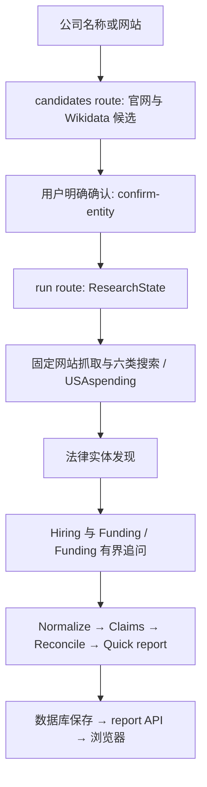
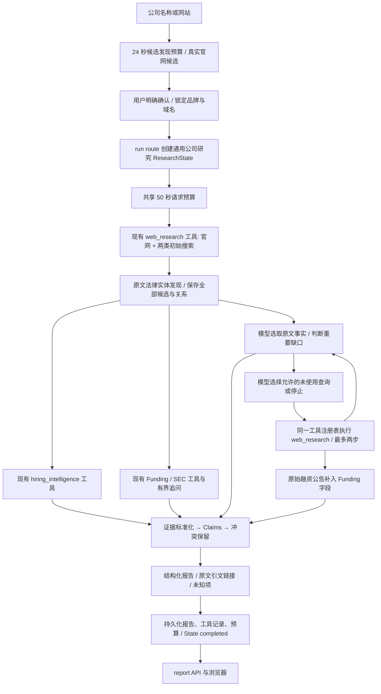

# Clara 有界自主研究：实现与实测

日期：2026-09-18。范围：现有 Quick Company Intelligence；没有改写 Ethan/Mason/Nora，没有引入多 Agent、LangChain、RAG 或私营公司数据库，没有提交、推送、部署或修改生产数据/环境配置。

## 1. 实际瓶颈

诊断以真实 Next.js routes、浏览器、原始网页、外发请求观测和隔离数据库读回为依据。

- Quick 并未调用已存在的通用 `runClaraAgentStep`。原路径是固定 website + 六类搜索 + 政府来源，再接 Hiring/Funding；仅 Funding 的模型追问真正生效。注册工具、ResearchState 存在不等于产品已经自主研究。
- 六类搜索结果按查询顺序拼接后一起截断，前面的查询挤掉近期动态/融资页；未知国家默认走美国政府查询，消耗预算却没有解决一般公司研究问题。
- 名称子串匹配过宽：Abaka 的同名讣告和 Mercury Systems 的国防业务进入错误目标的证据；公司官网也可能在描述客户、竞争对手或文章作者，不能只按域名归属整页所有人名。
- 原始页面→结构化字段→报告之间丢失信息：近期动态缺少可消费字段，通用追问的融资公告没有回流融资报告。姓名抽取出现 `Founder Christina`、`University. Stevie`；法律条款被当作服务。
- 招聘页的“Next”和演示链接曾被计为两个职位。删除伪职位后，浏览器又暴露了失败时显示“0 open roles”的映射问题，现已改为数量不可用。
- 长模型输出可能超过请求超时。改成选取短原文引文并由服务器绑定来源，不要求模型重复 URL、ID 和长段落。
- 仅输入 Mercury 时，同名 Wikidata 结果挤掉正确官网。现保留官网候选名额并排序；官网内容仍须支持候选，仍须用户确认。法律名称展示复用法律实体分析，不能把 Advisory 披露的首个名称直接显示为品牌运营主体。

## 2. 实际执行图

原 Quick：



现在的 Quick：



没有并列创建第二个工具注册系统。`research/adaptive.ts` 调用现有 `getClaraTool`、`executeClaraTool`；新代码只补足 Quick 缺失的轻量循环。Deep 工作流边界保持。

## 3. 确定性与模型边界

确定性负责身份确认、域名/SSRF/robots 检查、网络调用、请求上限、结构化解析、去重、注册工具校验、查询白名单、原文引文校验、证据关联、冲突及持久化。Form D 解析器未在本轮修改。

模型负责从已抓取页面选择具体原文事实，并在确有缺口时选择服务器允许的下一查询，或停止。当前通用查询限于官网的概览、产品、主要人员、近期动态；融资沿用现有专用追问能力。故意不开放任意 URL、代码执行或自由改写公司身份。模型返回的引文必须逐字存在于绑定的原文，搜索摘要不能成为事实。引文的存在不自动证明事实正确，仍标注公司披露/独立来源报道及来源日期。

## 4. 数据源选择

配置只检查存在性，没有输出任何 key、User-Agent 值或联系邮箱。SerpApi、Tavily、DeepSeek、SEC_USER_AGENT 已存在；SAM/USPTO/PatentsView/CourtListener 对应 key 未发现。本轮不需要用户添加 `.env.local` 项。

| 来源 | 决策 | 解决问题 / 可访问性与 key | 匹配、维护和增量价值 |
|---|---|---|---|
| 公司官网、Terms/Privacy、官方公告 | KEEP | 业务、领导、法律主体、公司披露融资；公开页面无 API key | 已确认域名，但逐条辨别主体；保留原文和时间；高价值 |
| SerpApi + Tavily 现有共享搜索 | KEEP | 找原始页面；均使用已有凭据 | 仅发现线索，原页必须成功获取；有配额/速率限制；复用 fallback，未新增供应商 |
| 通用缺口追问 + 公告字段回流 | ADD NOW | 已有工具的新接线；无需新增 API | 打通有用信息到报告的断点，比加入更多供应商优先 |
| 投资人公告、可信新闻 | KEEP | 使用现有搜索发现并取原文，无额外聚合 API | 要求目标名称与官网域名交叉支持；转载不算独立确认；保守规则可能漏掉不链接官网的真实报道 |
| SEC submissions / EDGAR Form D | KEEP，条件执行 | [公开 SEC API 无 key](https://www.sec.gov/search-filings/edgar-application-programming-interfaces)；已有 User-Agent | 法律主体、CIK、佐证分别校验；名字相似不能核验；失败不阻断其他研究 |
| 官方链接的 Greenhouse / Lever / Ashby | KEEP | 公开职位接口：[Greenhouse](https://docs.greenhouse.io/job-board.html)、[Ashby](https://developers.ashbyhq.com/docs/ashby-job-postings-api)；公开读取无需新增密钥 | 需确认官网到 ATS 的关联；现有适配器可用，但嵌入式页面发现仍有缺口 |
| USAspending | KEEP，相关时才调用 | [公开联邦支出 API](https://api.usaspending.gov/docs/endpoints)，合同/授予；无新增 key | 只对明确政府/国防等行业执行；通用公司研究增量低，同名 recipient 风险高 |
| SAM.gov | DEFER | [Entity API 需要 API key](https://open.gsa.gov/api/entity-api/)；当前未发现 | 需 UEI/法定主体等可靠匹配，适合政府承包研究；与 USAspending 有重叠 |
| 州公司注册处 | DEFER | 可查法人登记；州别访问方式不一：[California 查询](https://www.sos.ca.gov/business-programs/business-entities/cbs-search-tips)、[记录获取](https://www.sos.ca.gov/administration/public-records-act-requests/business-entity-records) | 名称不唯一且不代表品牌关系；辖区不明时成本高；不先建全国聚合器 |
| USPTO / PatentsView | DEFER | 专利/受让人：[PatentsView API](https://search.patentsview.org/docs/docs/Search%20API/SearchAPIReference/) 需 key，当前未发现 | 受让人历史、更名与集团关系需独立处理；普通研究增量低 |
| CourtListener / 监管法律记录 | DEFER | [CourtListener API](https://wiki.free.law/c/courtlistener/help/api/rest/v4/rest-api-v47) 按访问方式认证/限额；当前未配置 | 同名诉讼主体风险高；仅在明确法律/监管问题出现时值得接入 |
| 新付费私募数据库、搜索摘要直接当证据 | DO NOT ADD | 目前不是凭据不足造成主要缺口 | 费用、授权和匹配复杂度增加；不能修复原文到报告的数据流断点 |

## 5. SEC / 法律实体

沿用公司法律页面的候选、关系、支持摘录、检索时间和状态。保留品牌显示身份；研究过程不覆盖确认时的 identity graph。仅 accepted primaryOperatingEntity 进入 SEC 查询，Advisory/Lending/基金/SPV 和无法绑定品牌的名称不会自动升级。

本轮 Mercury 实际请求 `data.sec.gov/submissions/CIK0001719932.json` 成功返回 200；`Mercury Technologies, Inc.` 名称匹配，但缺少独立公司识别佐证，仍为 `unresolved / insufficient_corroboration`。另一个 `CIK0001049521` 返回 Mercury Systems，明确拒绝。去掉了“仅城市/邮编”触发完整业务地址冲突的问题：不完整地址既不当作地址匹配，也不当作地址冲突，完整冲突和核验门槛保持。

没有以生成报告当作 SEC 成功的证据。此次 SEC 证明的是连接与 submissions 读取；不是发行人核验，也没有证明原始 Form D 成功解析。最终轮 Abaka 没有 CIK，因此没有 SEC 外发；Vanta 后续发现 `CIK0001934145`，submissions 200，但仍因缺少佐证而 unresolved；另一个 Vanta Development Group `CIK0001907493` 被明确拒绝。没有假称所有 CIK 都核验成功。已有 [SEC fair-access](https://www.sec.gov/about/webmaster-frequently-asked-questions) 配置继续使用，未伪造身份；现有 SEC 请求间隔与重试限制保留。

## 6. 预算与停止

研究阶段共享预算：50 秒 deadline、9 次搜索外发、44 次页面请求（含 robots/重定向/ATS）、8 次模型请求、8 次官方 API 请求、10 次工具尝试。所有 Quick 分支共享；每个网络请求按剩余时间 abort。普通请求至多 6 秒，模型至多 11 秒。页面 GET 只在单次 run 内复用。发现候选另有 24 秒预算，适配 candidates route 的 30 秒上限。

通用追问最多两步。初始两类查询允许最多三次传输尝试，以容纳一次主搜索失败后的 fallback；总体九次搜索上限不变。Funding 仍有较小的独立预算，并受全局上限约束。遇到足够支持、来源耗尽、无新增证据、访问失败、模型无效、时间/次数上限就停止。停止与“信息完整”严格区分，State completed 表示本次执行完成，报告仍保留未知。

这些是请求/工具预算，不是承诺生产环境总 wall time 必为 50 秒；路由启动、数据库和渲染尚有开销。保留给 60 秒研究路由的余量。

## 7. 评估方法

使用 Abaka（较小 AI 公司且有职位）、Mercury（歧义品牌且有融资公告）、Vanta（信息丰富的私营公司）作为重复评估集。控制组和改进组都执行 candidates → explicit confirm → run → report API → 直接读隔离数据库，再重发 run 检查没有新增工具执行。测试没有手工输入法律实体、CIK、融资金额或领导事实。控制输入包含官网；另做浏览器只输入公司名的验证。

[机器结果](results.json) 保留请求数、事实原文、来源 ID/URL、融资字段、发行人结论和读回检查。搜索结果在抓取前的线索总数未在基线完整记录，所以“原始来源数”指成功保留的原始页面，不能冒充所有发现线索。

基线与后续有 provider 差异：早期 SerpApi 可用，后期遇到 429 等限制，由既有 Tavily fallback 接管。网站和模型选择也会变化。时间对比是观测值，不是隔离 provider 延迟的因果实验。所有失败保留，不把中途最好结果当作稳定保证。

以下是最后一轮完整 live 运行（`after`），不是前面较快的中间轮次。

| 公司 | 用时，秒 前→后 | 搜索/页面/模型/官方请求 前→后 | 成功原始页面 前→后 | 报告证据 / Claims 前→后 | 通用原文事实（live） |
|---|---:|---|---:|---|---:|
| Abaka | 41.96 → 23.53 | 8/45/2/7 → 6/28/5/0 | 16 → 14 | 24/20 → 22/32 | 10 |
| Mercury | 33.67 → 25.45 | 10/51/3/4 → 6/37/5/1 | 27 → 23 | 30/30 → 22/33 | 6 |
| Vanta | 30.67 → 43.12 | 10/49/4/1 → 9/44/7/2 | 31 → 25 | 20/37 → 17/27 | 7 |

三组全部 HTTP 200；报告 API 与数据库 JSON 一致，确认 graph 未改，重复 run 无新增工具执行。所有报告 claim 的 evidence ID 可解析；本轮通用引文均逐字存在于持久化原文，未发现悬空关联或伪造引文。基线通用引文计数为 0 是因为尚无该字段，不表示基线没有任何有用事实。

| 公司 | 有用证据的实际变化 | 未解决 / 不作为新增成果计算 |
|---|---|---|
| Abaka | 保留原有数据收集/清洗/标注、CEO/COO/VP、9 个真实职位；本轮也取得研究负责人及合作负责人原文。排除同名讣告 | 融资、法律主体、CIK、可靠有日期的近期事件仍缺失；产品导航与空泛宣传不算有用新增事实 |
| Mercury | 基线没有融资事件；本轮原始公告进入 Series D 金额 200M、估值 5.2B 两个独立字段，并保留收购 Central、Mercury Insights 的公司披露。排除 Mercury Systems 国防业务 | 当前轮模型追问未完成；主要人员抽取存在轮次波动，不能把中间轮的 CFO/CCO 当成本轮稳定覆盖；职位数量未知；issuer 未核验 |
| Vanta | 基线有 CEO 与部分融资字段，但近期动态缺失；本轮新增 Riskey 收购、FedRAMP 支持的原文证据，Series C 同一句的金额 150M 与估值 2.45B 均入库。去掉畸形人名和法律账单“服务” | 领导团队不保证完整；招聘未知；issuer 未核验；最后一轮到 44 页面/9 搜索上限，耗时 43.12 秒，比基线更慢 |

没有把 claims 数量当作有用事实数：重复的公司简介、宽泛产品宣传、导航、同一人重复职务不计新增价值。可清楚计数的关键新增字段是 Mercury 的融资金额/估值 2 项，Vanta 的 2 项实际发展事件；Abaka 的主要价值是维持既有有用覆盖并清除错误归属。

已确认的基线误报包括 Abaka 同名讣告 1 项、Mercury 同名公司业务 1 项、Vanta 2 个人名污染，以及 Mercury/Vanta 各 2 个伪职位。中间 `pre-final` 轮还暴露了 Mercury Raise 项目被当作 Series A；已修复并在 `after` 实测消失。这些只是定向人工复核发现，不是全域准确率估计。

最后检查又收紧了两项确定性主题过滤：产品导航串和没有人物/职位的“公司成立理念”。对上述 live 原文直接重放，Abaka 10→9、Mercury 6→5、Vanta 7→7；[重放结果](final-filter-replay.json) 明确记录被排除原文。这两个最终过滤改动通过测试与构建；没有为它们再次花费 provider 配额，也没有改写历史 live 数据库。因此表中 live 计数保留原值。

最后一轮使用 SerpApi/Tavily 的外发次数分别为 Abaka 4/2、Mercury 1/5、Vanta 1/8。Tavily 为已有 fallback，所有外发计入预算。通用模型事实和 tool action 有校验但仍非完全稳定；运行成功不代表每个缺口都已解决。


## 8. 完整的真实研究实例

最终轮 Vanta `2836753f-a215-4fa9-9caa-bc03b2e08876` 同样完成端到端：确认 vanta.com → 初始研究发现产品/近期动态缺口 → 模型依次选择官网产品查询、2026/2025 公告查询 → 两次注册工具执行成功 → 原始页面带来 Riskey 收购与 FedRAMP 支持等引文 → SEC 未核验、招聘不可用保留 → Quick 报告成功入库并与 report API 相等。到两步上限停止；这是最后代码主体的 live 例子。

已完成的 Mercury route 运行 `02783331-3710-448c-a793-e77ac8690cff`：

1. 候选发现获得 mercury.com，显式确认后锁定 Mercury。没有人为提供法律主体、CIK、融资字段。
2. Clara 读取官网、法律页面和领导公告，识别近期动态缺口。
3. 模型通过现有 `web_research` 选择 `site:mercury.com "Mercury" announces launch 2026 2025`。
4. 抓到公司 [Series D 原始公告](https://mercury.com/blog/series-d-announcement)。页面明确披露融资金额 200 million、估值 5.2 billion；接受的是原始正文中的字段证据，不是摘要。
5. 新追问页自动进入融资抽取/标准化/claims/report，持久化 `amount=200000000`、`valuation=5200000000`、`roundLabel=Series D`，字段各有 URL 和 excerpt。主要证据 ID：`serpapi-02783331-3710-448c-a793-e77ac8690cff-1-research-3`。
6. 裸 `$` 的币种、估值口径、明确事件日期等缺少合格字段证据的项仍未知；公司公告不标为 SEC 核验。涉及 OCC 的描述仅公司披露，未伪称已查 OCC。Series C 的 primary/secondary 说明保留，未把累计融资和单轮相加。
7. `report API == DB report`，确认 graph 未变；重复 run 没有新增工具执行。

独立的最终浏览器 Mercury 名称输入运行 `4bdb529d-fcdf-4693-9c2d-e4a3ffecb938` 找到正确官网，确认卡不再误标 Advisory 为法律主体；报告成功持久化并读回一致，State completed。但该次通用模型追问未完成，记录为 `planner_unavailable_or_invalid`（旧诊断没有细分超时和无效输出），因此没有取得前述 Series D，近期动态仍有缺口。它的 SEC 两次 submissions 均 200，仍未核验。这是实测的稳定性限制，不掩盖、不注入手工事实、不将前次结果移植进该报告。浏览器日志检查未返回 console error；招聘不可用已实际显示为 unknown，而非零岗位。

## 9. 改动文件

完整 `app/` 路径以 `site/` 为根；未写 `app/` 前缀的服务模块以 `site/app/lib/private-diligence/` 为根，脚本/测试/文档以 `site/` 为根。本轮开始时已有大量未提交工作，以下仅列本轮触及模块，不能把整个 git diff 当成本轮新增。

- `app/lib/private-diligence/research/{budget,types,adaptive}.ts`：共享预算、事实与覆盖状态、有界追问。
- `app/lib/private-diligence/engine.ts`、`modelRouter.ts`、`planning/quickResearchPlanner.ts`：Quick 接线、短引用、相关性选源。
- `tools/{types,webResearchTool,hiringIntelligenceTool}.ts`、`search/sharedSearch.ts`：复用注册表、查询校验、计量。
- `funding/{budget,research,extraction}.ts`：全局预算接入、通用公告回流、金额/估值分别提取、累计融资保护。
- `entity-resolution/{candidateDiscovery,secIssuerResolution}.ts`：公司名候选、法律名称展示、完整地址比较。
- `providers/{companyWebsiteProvider,serpApiWebSearchProvider}.ts`、`extraction/htmlExtractor.ts`：原始页面匹配、平衡结果、姓名/服务污染过滤。
- `hiring/adapters.ts`、`app/ClaraHiringIntelligence.tsx`：去伪职位及 unavailable 显示。
- `types.ts`、`evidence/{evidenceRegistry,claimRegistry,claimReconciler}.ts`、`reports/{quickReportBuilder,quickReportPresentation}.ts`、`app/ClaraPrivateDiligenceWorkflow.tsx`：引文贯穿证据/claims/报告/UI；冲突不静默覆盖。
- `app/api/private-diligence/{candidates,run}/route.ts`：候选预算、研究目标、完成状态。
- `scripts/evaluate-clara-deep-research.mjs`、新增/更新 Clara 测试及本文/result JSON。

## 10. 复现与验证

从 `site/` 启动 `node scripts/start-clara-funding-diagnostic.mjs`。该 launcher 读取已有授权配置，创建临时 SQLite，移除子进程远程数据库变量，并防止 Next 再从 env 恢复远程 DB；打印隔离 DB 路径和 localhost:3012。

创建一个临时输出目录，然后在仓库根目录执行：

```sh
EVAL_OUTPUT=/private/tmp/clara-eval-output EVAL_DATABASE=/absolute/path/from/launcher/clara.db node site/scripts/evaluate-clara-deep-research.mjs
```

只使用 launcher 打印的隔离数据库路径。脚本走实际 HTTP 路由，没有替换生产路径为 mock。运行完成保留 JSON 做逐项审查，关闭本地服务器。

验证最终状态：

| 检查 | 结果 |
|---|---|
| `npm test` | 264/264 通过；包括 vinext build |
| ESLint | 通过，无错误/警告 |
| `tsc --noEmit` | 通过 |
| `next build --webpack` | 通过；保留既有 Playwright 动态 import 警告和 Node module.register 弃用警告 |
| `git diff --check` | 通过 |
| 真实配置 provider | 官网、搜索 fallback、DeepSeek、SEC submissions 实际请求；没有替换为 mock |
| Next 路由 + 隔离 DB | 三家公司均完成候选、明确确认、研究、报告读取；JSON 一致，身份未变，重复请求不新增工具执行 |
| 浏览器 | Mercury 仅公司名发现、明确确认、报告/证据链接/unknown 渲染；Vanta 报告亦实际检查；没有返回 console error |
| 最后两项过滤 | 对真实持久化原文离线重放及回归测试；不冒充一次新的 live run |

[浏览器核对记录](browser-validation.json)。所有本任务启动的本地服务器已关闭；隔离评估数据留在临时目录，项目内仅保留脱敏诊断摘要。

## 11. 已知限制与下一步

- 这是向深度研究推进的有界 Quick MVP，不是已经完成所有领域的 Deep Research。模型会漏掉事实或返回不合法行动；本次浏览器已有实例。
- 原文精确引用可证明出处，不能自动解决语义归属或所有跨来源矛盾。结构化融资冲突继续显式保留；通用自由文本目前不会做完整语义冲突裁决。
- “有产品事实”不保证产品全貌；营销性自述仍可能进入报告，需继续优化信息价值评估。没有以原文条数/报告长度作为质量分数。
- 近期动态采用页面发布时间，不能当成事件发生日；历史人员职务按来源日期说明。网页元数据日期可能晚于文章所描述月份。
- 招聘 iframe/嵌入 board 的发现仍不完整。Mercury/Vanta 的本次未读到结构化职位不能理解为没有招聘。
- 公司名发现仍依赖公共目录及候选域名，可能漏掉非显然域名；需要用户确认，不将排名当作法律核验。
- SEC 仍受主体佐证不足约束。若只剩名称相同，返回 unresolved 并继续一般研究。不能宣称 Form D 问题已经全面解决。
- 已抓取页面/模型输入都有数量和长度上限；部分真实第三方报道会因缺少官网关联而被保守排除。

下一项最高价值改进：从已确认官网/招聘原文中的真实 ATS 职位链接和 iframe 发现 board 标识，再调用既有 ATS adapter。Mercury 的页面已含官方 Greenhouse 链接但本次未进入结构化职位，证据清楚、增量明确，也不需要新供应商或猜测 board/公司身份。
